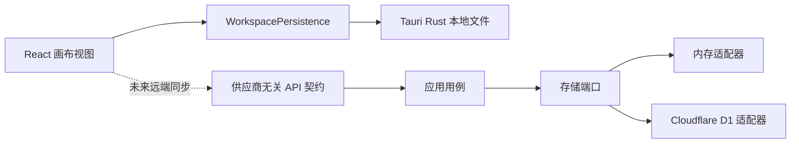

# 关联信息开发者说明

本文面向希望本地运行、修改、测试或扩展关联信息的开发者。产品使用方式见 [README.md](README.md)，已经确认的设计规则和阶段计划见 [DEVELOPMENT_PLAN.md](DEVELOPMENT_PLAN.md)。

## 设计目标

- 数据模型保持通用：节点可以代表实体、标签或关系记录，不增加账号、服务等固定业务类型。
- 视图与数据解耦：无限画布只是第一种展示方式，领域数据不包含坐标、缩放和筛选状态。
- 本地保存始终可用：远端提供者失败不能阻断本地编辑。
- 后端提供者可替换：Cloudflare D1 是一个适配器，不进入领域层或桌面视图。
- 边界严格校验：外部数据在导入、持久化和 API 边界完成验证，内部代码使用有效快照。

## 仓库结构

| 路径 | 作用 |
| --- | --- |
| `apps/desktop` | React、TypeScript、React Flow 和 Tauri 2 桌面应用 |
| `apps/desktop/src-tauri` | Rust 桌面壳、本地文件持久化和单实例生命周期 |
| `apps/cloudflare-worker` | 可选的 Cloudflare Worker HTTP 入口与 D1 绑定 |
| `crates/domain` | 节点、引用和领域不变量 |
| `crates/application` | 与存储实现无关的应用用例 |
| `crates/contracts` | 供应商无关的 API DTO、错误码和 OpenAPI 契约 |
| `crates/storage-port` | 存储端口接口 |
| `crates/storage-memory` | 测试和本地用的内存适配器 |
| `crates/storage-d1` | Cloudflare D1 存储适配器 |

当前桌面应用不调用 Worker。两条路径分别演进：



## 工作区数据不变量

正式工作区、持久化快照和导出包共用同一组约束：

- 节点 ID 是规范化的小写 UUID，且全局唯一。
- 名称可以为空；非空名称规范化后唯一。
- 内容可以为空，当前为纯文本。
- 每个节点恰好有一个有效画布布局。
- 引用的源节点和目标节点必须存在，同一对引用不能重复。
- 画布视口属于工作区视图数据，不属于节点领域模型。

节点引用是有方向的。两个节点之间的专属信息应放入第三个普通关系节点，由关系节点同时引用所有参与方。多引用筛选使用 AND 语义。

## 本地持久化

桌面组件只依赖异步 `WorkspacePersistence`，不直接操作存储实现：

- 正式 Tauri 模式由 Rust 读写 `workspace.v1.json` 和 `workspace.recovery.v1.json`。
- 写入先落到同目录唯一临时文件，刷新内容后使用操作系统能力原子替换目标文件。
- 同一持久化实例中的写入按调用顺序串行执行，旧快照不能晚于新快照完成。
- 关闭窗口时先阻止默认关闭，等待完整工作区写入成功，再由 Rust `AppHandle::exit(0)` 退出应用。
- 写入失败时保持窗口打开并显示错误。
- 桌面端保持单实例；第二次启动只显示并聚焦已有主窗口。
- 浏览器开发模式使用 `localStorage`，并作为旧版桌面数据的一次性迁移来源。

## 开发环境

CI 当前使用：

- Rust stable，工作区 edition 2024。
- Node.js 24。
- pnpm 11.16.0。
- Worker 检查需要 `wasm32-unknown-unknown` target。

Tauri 在 Linux 上还需要 WebKitGTK、AppIndicator、librsvg 和 patchelf 等系统依赖；准确列表见 [.github/workflows/desktop-packages.yml](.github/workflows/desktop-packages.yml)。

### 桌面前端

```powershell
cd apps/desktop
pnpm install --frozen-lockfile
pnpm dev
```

`pnpm dev` 只启动浏览器开发视图，使用 `localStorage`。运行完整桌面环境：

```powershell
cd apps/desktop
pnpm tauri dev
```

### 前端测试与构建

```powershell
cd apps/desktop
pnpm test
pnpm build
```

### Rust 检查

```powershell
cargo fmt --all -- --check
cargo test -p linked-info-contracts -p linked-info-domain -p linked-info-storage-port -p linked-info-storage-memory -p linked-info-application
cargo check -p linked-info-desktop
cargo test -p linked-info-desktop --lib
```

Worker 的 wasm 检查：

```powershell
rustup target add wasm32-unknown-unknown
cargo clippy -p cloudflare-worker --target wasm32-unknown-unknown -- -D warnings
```

## 打包

本地执行完整 Tauri 打包：

```powershell
cd apps/desktop
pnpm tauri build
```

仓库的 `Desktop packages` GitHub Actions 工作流可以手动生成 Windows、macOS 和 Linux 产物。Windows 当前使用 `--no-bundle` 生成便携版 EXE，其他平台生成 Tauri bundle。构建目前没有商业代码签名。

## Cloudflare 适配器

Cloudflare 不是桌面端的固定依赖。`apps/cloudflare-worker` 通过供应商无关的应用层和存储端口接入 D1；Cloudflare 类型不得进入领域 crate 或桌面 React 组件。

仓库没有包含远程数据库 ID、API 令牌或已部署地址。`wrangler.jsonc` 中的 D1 `database_id` 保持为 `local`，只有实际创建远程资源时才由部署者在自己的环境中配置。不要提交 `.env`、Wrangler 登录状态、令牌或数据库导出。

## 修改约定

- 先搜索同类实现，保持现有模式一致。
- UI 文案必须同时进入 `apps/desktop/src/locales.ts` 的中文和英文资源，不能在组件中直接硬编码。
- 画布坐标、层级、缩放和筛选状态不能写入节点领域模型。
- 新存储实现通过 `storage-port` 或 `WorkspacePersistence` 接入，不让供应商 SDK 穿过边界。
- 修改数据模型或持久化前先补充不变量测试；修复交互问题时保留可复现的回归测试。
- 不要把本地工作区、导出备份、账号信息或任何凭据加入测试夹具和提交历史。

提交前至少运行受影响范围的测试，并确保 `cargo fmt --all -- --check`、`pnpm test` 和 `pnpm build` 通过。完整检查以 [.github/workflows/ci.yml](.github/workflows/ci.yml) 为准。

## 许可证与贡献

项目使用 [Apache License 2.0](LICENSE)。除非贡献者明确另行声明，提交给本项目并被接收的贡献按照同一许可证提供。
