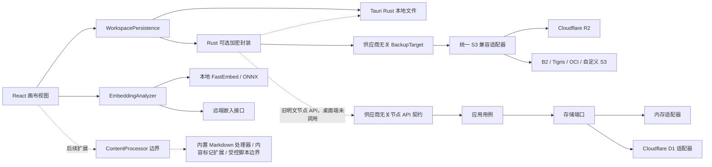

# 关联信息开发者说明

本文面向希望本地运行、修改、测试或扩展关联信息的开发者。产品使用方式见 [README.md](README.md)，已经确认的设计规则和阶段计划见 [DEVELOPMENT_PLAN.md](DEVELOPMENT_PLAN.md)，安全承诺和威胁模型见 [SECURITY.md](SECURITY.md)。

## 设计目标

- 数据模型保持通用：节点可以代表实体、标签或关系记录，不增加账号、服务等固定业务类型。
- 视图与数据解耦：无限画布只是第一种展示方式，领域数据不包含坐标、缩放和筛选状态。
- 本地保存始终可用：远端提供者失败不能阻断本地编辑。
- 后端提供者可替换：Cloudflare D1 是一个适配器，不进入领域层或桌面视图。
- 智能能力可替换：向量分析器依赖供应商无关接口，本地 ONNX 与远端嵌入 HTTP 只是适配器；派生向量和分数不进入领域模型。
- 加密由客户端掌握：密码保护模式中的本地文件、备份和未来远端同步都使用客户端密钥；存储提供者只接收密文。
- 内容使用方式可扩展：Markdown 通过基础内容处理器加入，正文选区通过可移植的内容标记交给 TOTP、秘密等扩展处理，脚本能力必须经过受控执行边界；这些用途不固化为节点类型，也不允许 WebView 任意执行节点文本。
- 边界严格校验：外部数据在导入、持久化和 API 边界完成验证，内部代码使用有效快照。

## 仓库结构

| 路径 | 作用 |
| --- | --- |
| `apps/desktop` | React、TypeScript、React Flow 和 Tauri 2 桌面应用 |
| `apps/desktop/src-tauri` | Rust 桌面壳、本地文件持久化和单实例生命周期 |
| `apps/cloudflare-worker` | 可选的 Cloudflare Worker HTTP 入口与 D1 绑定 |
| `crates/domain` | 节点、引用和领域不变量 |
| `crates/application` | 与存储实现无关的应用用例 |
| `crates/contracts` | 供应商无关的 API DTO、错误码和 OpenAPI 契约 |
| `crates/storage-port` | 存储端口接口 |
| `crates/backup-port` | 供应商无关的密文快照与备份目标端口 |
| `crates/storage-memory` | 测试和本地用的内存适配器 |
| `crates/storage-d1` | Cloudflare D1 存储适配器 |

当前桌面应用不调用 Worker。可选节点 API 与桌面本地路径分别演进；异机备份由桌面 Rust 直接调用标准 S3 兼容接口：



## 工作区数据不变量

正式工作区、持久化快照和导出包共用同一组约束：

- 节点 ID 是规范化的小写 UUID，且全局唯一。
- 名称可以为空；非空名称规范化后唯一。
- 内容可以为空，领域层始终是字符串；视图层当前内置纯文本和安全 Markdown 两种处理器。
- 每个节点恰好有一个有效画布布局。
- 引用的源节点和目标节点必须存在，同一对引用不能重复。
- 画布视口属于工作区视图数据，不属于节点领域模型。

节点引用是有方向的。两个节点之间的专属信息应放入第三个普通关系节点，由关系节点同时引用所有参与方。多引用筛选使用 AND 语义。

## 本地持久化

桌面组件只依赖异步 `WorkspacePersistence`，不直接操作存储实现：

- 正式 Tauri 模式由 Rust 读写 `workspace.v1.json` 和 `workspace.recovery.v1.json`。
- 写入先落到同目录唯一临时文件，刷新内容后使用操作系统能力原子替换目标文件。
- 同一持久化实例中的写入按调用顺序串行执行，旧快照不能晚于新快照完成。
- 关闭窗口时先阻止默认关闭，等待完整工作区写入成功，再由 Rust `AppHandle::exit(0)` 退出应用。
- 写入失败时保持窗口打开并显示错误。
- 桌面端保持单实例；第二次启动只显示并聚焦已有主窗口。
- 浏览器开发模式使用 `localStorage`，并作为旧版桌面数据的一次性迁移来源。

桌面端现已在 `WorkspacePersistence` 与文件适配器之间实现 Rust 可选加密封装：随机数据密钥加密工作区，Argon2id 从用户密码派生密钥来保护数据密钥，XChaCha20-Poly1305 提供保密性和认证。未启用加密的工作区仍以明文保存；启用后，正式工作区、恢复副本、正常导出和不可读数据导出都写成版本化密文。React 会在解锁表单中短暂持有密码字符串，但不把密码或数据密钥持久化。桌面端仍未连接任何远端同步后端；现有 Worker/D1 节点 API 不能直接承载密码保护工作区的同步，后续需要独立的密文封装契约。

普通修改主密码只重新封装现有数据密钥；独立的数据密钥轮换会先推进 Rust 访问代次并卸载明文工作区，再生成新的随机数据密钥。Rust 在 `.workspace.data-key-rotation.v1.pending` 中准备新的正式文件、恢复副本、历史和 vault：`preparing` 阶段中断时删除待提交数据与新设备凭据，`ready` 阶段中断时由下次安全状态检查幂等完成提交。正式 vault 最后替换，是事务提交点；在此之前任何普通工作区命令看到待处理事务都会失败关闭，不能越过恢复流程。系统快速解锁启用时一并生成新设备密钥和凭据，只有新 vault 提交后才删除旧凭据。轮换命令成功或失败都不恢复已经撤销的明文会话。

设备本地自动备份历史由独立的 `WorkspaceBackupHistory` 前端端口和 Rust 文件适配器提供。Rust 只在主工作区原子写入成功后复制完整主文件，按一小时最小间隔、30 份、512 MiB 和 90 天上限轮换；应用每次解锁加载工作区时也会检查期限，避免长期不编辑时已删除秘密无限留在历史中。超过 90 天的历史全部回收；若当前内容没有变化，下一次快照检查会建立一份新的同内容快照。Rust 与 TypeScript 在各自持久化边界都完整校验节点 UUID、非空名称唯一性、布局一一对应、引用端点、重复引用和视口数值；恢复安装明确区分可移植的 `WorkspaceExportDocument` 与本机 `WorkspaceStorageEnvelope`，只把导出文档中验证后的 `workspace` 转换为主文件，不能原样混用两种格式。通过校验的目标工作区先进入独立的只读恢复画布，以当前与目标的同坐标叠加图展示节点、引用和布局差异；只有用户确认后才进入替换事务，取消则丢弃目标快照并返回原页面。确认后的整工作区替换不会进入可能复制十万节点的内存历史栈，而是建立一条会话级磁盘恢复边界：替换后的新编辑先进入普通撤销栈，普通历史用尽后的 `Ctrl+Z` 通过 `WorkspacePersistence.swapWithRecovery()` 交换主工作区与恢复副本，`Ctrl+Y` 可反向交换；从撤销后的旧工作区产生新编辑时废弃重做分支。启用加密时，既有历史先写入独立待提交目录并逐份验证，之后才与主文件和 vault 元数据一起提交，因此不会在已经宣称加密后留下旧的明文快照。自动历史、替换前恢复副本和可移植导出采用不同接口与生命周期，不能互相替代。

解锁方式限定为主密码与可选的“系统快速解锁”。主密码封装始终保留并随加密导出提供跨设备恢复；系统快速解锁只对当前设备有效，两者采用 OR 语义。Windows 适配器必须先通过 Windows Hello 的 PIN、指纹或人脸验证，随后才读取 Credential Manager 中的独立随机设备密钥。系统快速解锁不保存主密码、不进入导出或同步，也不被描述为第二因素；同一登录用户会话已经被恶意程序控制时，平台安全存储不能替代系统隔离。macOS 与 Linux 在实现可保证逐次用户验证的适配器前不开放该入口。

解锁后的授权仍属于 Rust 安全状态，不等于 React 界面可无限期读取明文。安全加固按三层边界实施：CSP 限制 WebView 可以加载和连接的来源，Tauri capability 限制窗口能调用的插件及 IPC，Rust 命令再校验工作区是否解锁、敏感操作是否刚完成重新认证以及异步任务代次是否仍有效。锁定必须先使 Rust 明文授权与旧任务代次失效，再停止模型、清理令牌和卸载界面；任一清理失败都不能恢复授权。

正式构建不加载远端脚本，远端备份和 AI 请求由 Rust 适配器执行。文件导入导出已经改为 Rust 命令逐次显示系统对话框并直接读写，主 WebView 不再拥有通用文件读写插件权限。开发服务器需要的热更新与调试来源使用独立 `devCsp`，不能放宽生产 CSP。完整规则见 [SECURITY.md](SECURITY.md)。

本机删除分成三个边界：节点删除走领域操作并清理引用与布局；历史清除只删除自动历史和恢复副本；工作区销毁则使用独立的限定用途授权，先使 Rust 明文访问代次失效并停止模型，再删除系统快速解锁凭据以及正式、待提交、恢复、历史和 vault 文件，成功后直接退出应用。销毁失败时仍保持锁定，不能让 React 因文件操作失败重新获得原有明文会话；外部手动导出不属于应用管理目录，不会被销毁命令扫描或删除。

秘密剪贴板通过独立 `SecretClipboard` 前端端口和 Rust 自定义命令接入，不给 WebView 通用剪贴板权限。首个 Windows 适配器使用 `CF_UNICODETEXT` 写入完整节点内容并记录系统剪贴板序列号；45 秒计时、手动或闲置锁定、Windows 会话锁定或休眠、数据密钥轮换以及正常退出只在序列号仍相同时清空，因而不会删除用户随后复制的其他内容。Windows 会话通知先同步撤销工作区访问并触发剪贴板清理，再异步卸载模型，避免系统挂起等待推理进程。并发写入在 Rust 中串行化，命令在写入前后检查工作区授权代次；若写入期间发生锁定，会立即转入清除重试。明文字符串和 UTF-16 临时缓冲使用 `Zeroizing` 清理。非 Windows 平台在有等价适配器前报告不可用。

`scripts/check-sensitive-logging.mjs` 对直接处理工作区明文、密码、令牌、模型输入与剪贴板内容的模块执行源码门禁，并在 CI 中禁止普通 Rust 输出/日志宏和浏览器 console 日志。新增受保护模块时必须加入清单；需要诊断时使用不包含用户数据的结构化错误码，并先扩展规则测试。

## 智能引用边界

- `embeddingService.ts` 负责文本组装、有界分段、内存派生缓存、余弦相似度和候选排序，只依赖 `EmbeddingGateway`。
- Tauri 本地适配器使用 `intfloat/multilingual-e5-small` 和 FastEmbed/ONNX。模型首次使用时下载到系统应用缓存目录，不进入仓库、工作区或导出包。
- 首个远端适配器使用可配置的兼容嵌入 HTTP 端点，Rust 负责网络请求以避免把供应商网络逻辑写进 React 视图。普通 HTTP 只允许本机回环地址，其他端点必须使用 HTTPS。
- 远端端点和模型名是设备设置；远端令牌只在 React 当前会话内存中存在，不得写入持久化存储或日志。
- 提供者配置指纹变化时同时清除会话令牌，避免旧端点凭据被误发到新端点。
- 名称和内容都为空的节点不参与向量分析。长文本最多抽取八个分段并覆盖文本不同位置，防止无限推理或远端费用失控。
- 自动引用默认关闭；开启后仍只在用户明确触发分析时添加达到阈值的普通 `Reference`。重新分析和切换模型不自动删除引用。
- 阈值与提供者、端点和模型配置绑定。配置指纹变化时必须清空派生缓存并关闭自动引用，等待用户重新校准。

### 本地 LLM 复核边界

- `llmReview.ts` 负责从第一层结果与正式引用中构建有界候选、分配临时编号并验证模型响应；React 不接触 llama.cpp 的端口或进程。
- `LlmGateway` 是视图依赖的供应商无关边界。本地 Tauri 适配器使用 `review_local_references` 命令；远端 LLM 仍是以后可选适配器，不进入本轮实现。
- Rust 只接受最多 24 个候选、每个候选最多两条示例和有限长度文本，并再次验证编号与分组互斥。模型只生成 `selectedAliases` 和 `uncertainAliases`；Rust 根据两个数组是否均为空唯一推导 `noMatch`，避免冗余字段自相矛盾。无效响应直接失败，不修改正式引用。
- 本地运行时固定为 llama.cpp `b10344` CPU 构建；GitHub Actions 下载对应平台产物并校验 SHA-256，再作为 Tauri resource 打包。Windows 便携产物把整个 `llama-runtime` 目录放在 EXE 旁边，不能只复制 `llama-server.exe` 而遗漏动态库。正式应用与质量基准统一使用随机种子 `42`，避免默认 `-1` 让相同模型和提示在不同运行间产生不可归因的波动。
- 本地 LLM 可选模型固定为 `Qwen/Qwen3-1.7B-GGUF` revision `90862c4b9d2787eaed51d12237eafdfe7c5f6077` 的 `Qwen3-1.7B-Q8_0.gguf`，以及 `Qwen/Qwen3-4B-GGUF` revision `bc640142c66e1fdd12af0bd68f40445458f3869b` 的 `Qwen3-4B-Q8_0.gguf`。Rust 对每个文件按独立固定大小和 SHA-256 校验下载，模型只进入系统应用缓存；1.7B 保持默认，4B 用于质量优先的可选对比。
- llama.cpp 只监听 `127.0.0.1`，使用每次启动随机生成的 API key，关闭 Web UI、思考模式和上下文滚动；推理线程最多为 4，并至少给系统保留一个逻辑核心。
- 同一时间只允许一个本地 LLM 下载、加载或推理任务。禁用功能与正常退出都必须结束 sidecar，不能遗留后台进程。
- 智能引用写回时必须重新验证当前工作区中的源节点和目标节点；异步分析使用的旧快照不能直接越过当前数据边界。
- 本地 LLM 请求使用统一的保守 token 估算预算，并由 TypeScript 组装层和 Rust 命令边界双重约束。
- 已下载 GGUF 的就绪状态由绑定哈希、大小和修改时间的校验标记决定；Windows sidecar 还必须加入带 `KILL_ON_JOB_CLOSE` 的 Job Object，覆盖主进程异常退出。
- 远端向量提供者在缓存未命中时可能接收工作区全部非空节点的有界文本分段；任何 UI 和文档披露都必须按这个真实边界描述。
- 远端密文同步不等于远端 AI：存储适配器可以只保存密文，但嵌入或 LLM 服务必须看到明文才能分析。密码保护模式默认禁止远端 AI；在实现本地预筛选与明确秘密排除前，不得把当前全库远端向量流程用于已解锁工作区。

## 内容处理器边界

- `Node.content` 继续是可移植字符串。第一种富文本展示优先使用 Markdown 源文本和禁用危险 HTML 的安全预览，不采用编辑器私有 JSON 作为唯一存储。
- `ContentProcessor` 接收已解锁节点的只读快照，返回受约束的展示模型和显式动作；处理器偏好属于独立视图元数据，不进入领域层。
- “内容标记”与节点引用标签不同：前者声明正文中一段文字的使用方式，后者表达节点之间的关系。首版编辑器允许用户选中文字后显式选择 `totp` 或 `secret`；没有标记的相似文字不自动识别、不弹出确认。
- 内容标记直接序列化进 `Node.content`，首版形式为 `[[li:<type>]]<payload>[[/li]]`。类型标识只允许小写字母、数字和连字符；序列化器转义 payload 中的反斜杠和结束定界符；首版不允许嵌套。未知类型、缺少结束符或其他畸形标记必须按原文保留并安全显示，不能依赖字符起止偏移或编辑器私有 JSON。
- 注册表负责按 textarea 的 UTF-16 选区解析编辑上下文。普通非空选区生成新标记；光标或选区完全落在一个现有标记中时规范化为完整标记，并允许更换类型或移除外壳。跨越标记边界、覆盖多个标记或其他会产生嵌套的范围必须拒绝。更换类型与移除都使用解析后的 payload，不能用字符串替换猜测边界；移除后正文恢复 payload 本身。
- `ContentMarkerDefinition` 可以提供不产生副作用的 payload 校验器。所有新增和类型变更先校验再写入；TOTP 使用与实时验证码相同的解析器，校验失败不得改变正文。`secret` 不做内容识别或强度判断。
- 通用内容分段器不识别具体标记用途，只返回已登记标记；TOTP、秘密及后续扩展由独立展示注册表按 ID 接管。已登记标记与展示适配器必须一一对应，缺失敏感适配器时只能安全遮蔽，不能把 payload 当普通文字显示。
- `ContentMarkerRegistry` 为每种扩展登记标识、选区动作、校验和语义披露策略；独立的展示注册表登记画布/列表展示与受控动作。敏感扩展的 payload 在进入智能引用的向量、持久缓存和复核 LLM 前剥离；其他模型流程必须分别建立同等边界测试。加密工作区保存和客户端密文备份仍保留原始标记与 payload。
- TOTP 标记只在本机内存计算当前验证码；秘密标记默认遮蔽，只有用户显式显示或复制时才把 payload 交给对应界面动作。两者的派生值不得进入日志、持久化、远端同步或模型输入。Markdown 代码围栏中的标记只作为原文示例展示，但语义分析仍保守剥离已知敏感标记。
- TOTP 的周期刷新不得改变节点几何尺寸，否则 React Flow 会连带重算锚点和连线路径。倒计时区域保留固定宽度；跨周期计算新验证码时保留上一帧布局并禁用复制，直到新周期验证码就绪。同一画布的全部 TOTP 必须共享单个对齐秒时钟，动态行使用局部布局与绘制隔离，禁止按节点建立定时器并在低缩放下反复重绘共享连线层。浏览器回归测试必须同时检查时钟数量、TOTP 行宽、节点高度、连线路径和画布变换稳定。
- 旧的独立 `TOTP: <Base32>`、`TOTP：<Base32>` 和 `TOTP: <otpauth://totp/...>` 行继续兼容；新建内容优先由选区动作生成内容标记，不强制迁移或改写旧正文。
- 内置代码预览使用 `code.<language>` 处理器 ID复用现有开放视图元数据，不扩展 `Node`，也不为首版固定行号和长行滚动增加工作区字段。当前支持 PowerShell、Bash、Python、JavaScript、TypeScript、Rust、JSON、YAML 和 SQL；Prism 只在实际渲染代码节点时动态加载，并通过结构化 token 树生成 React 文本节点，不把高亮 HTML 注入 WebView。普通画布节点沿用 600 字符预览；手动高度和“适应内容”也最多渲染 20,000 字符或 500 行并明确提示截断，组件内部再次执行同一上限。完整正文仍只在编辑器和受控复制边界使用。
- 代码预览先通过通用内容增强器把已知敏感标记和旧式 TOTP 行替换为安全文字，再把结果交给高亮器；完整原文是否含敏感段使用未截断正文判断，并按节点对象身份增量缓存，单个节点输入不能重新扫描其他代码节点。React Flow 节点数据仍只接收有界预览和敏感布尔值；复制时通过节点 ID 从当前工作区读取完整正文。普通代码复制使用系统普通剪贴板，包含已知敏感段的原文只能使用现有秘密剪贴板命令；高亮器、DOM 文本和普通复制都不得收到敏感 payload。
- 脚本默认只能预览。执行必须经 Rust 权限代理和独立进程，默认无文件、网络、环境变量或其他秘密访问权，并具有超时、取消、输出上限和退出回收。
- 首批只允许经过审查的内置处理器。第三方扩展必须使用隔离进程与能力声明，不能向 WebView 注入任意 JavaScript。

当前工作区逻辑格式为 v2。v1 读取后会确定性迁移为 v2，并补入空的内容处理器视图元数据；后续保存、导出、历史与异机恢复只写 v2。TypeScript 和 Rust 共同读取 `fixtures/workspace-contract.json`，对合法图、重复名称、悬空引用、布局、视口和处理器元数据执行同一组边界测试。

源码已经建立共享 `ContentProcessorRegistry`、`ContentMarkerRegistry`、兼容行增强器与 `NodeContentHost`。画布和列表统一通过宿主展示正文；节点级基础格式当前内置纯文本、Markdown 和九种语言/格式的代码预览，局部用途由内容标记叠加，避免一个节点只能选择一种用途。用户在节点编辑器中显式选择基础格式，默认纯文本，选择作为工作区视图元数据参与保存与历史。Markdown 使用 CommonMark 渲染并忽略原始 HTML；链接降级为不可导航文字，图片降级为占位文字，因此节点预览不会加载远端资源。代码高亮使用懒加载的结构化 token 渲染，不执行正文。未知处理器或内容标记会安全降级并原样保留。节点编辑状态仍由节点卡片局部持有，DOM 回归测试覆盖长文本中间输入的光标、Enter、Shift+Enter、Backspace、处理器切换、选区标记和节点内部焦点切换；真实 Edge 回归覆盖选择、失焦保存与重载展示。

## 文档导入边界

杂乱文档采用独立的增量导入草稿，不通过完整工作区备份格式覆盖现有数据。TXT、Markdown 或粘贴文本可以先在本机确定性分段，再由当前本地 GGUF 模型逐段返回受 JSON Schema 限制的候选节点和引用名称；也可以载入 `linked-info-document-import-draft` 外部分析 JSON。TypeScript 负责边界验证、跨段合并、精确名称匹配、来源追踪、草稿编辑与目标快照生成。任何分析结果只有通过人工选择和画布差异预览后，才能作为一个工作区历史事务保存。

每次确认导入都会建立来源节点，保存来源名称、SHA-256、导入时间、分析方式和完整原文；所选候选统一引用该来源。精确匹配到已有非空名称时只建立匹配/引用，不修改已有节点内容。文件正文、节点正文和模型响应不得进入普通日志。应用本身仍不直接调用远端 LLM；外部草稿只接受用户主动选择的 JSON 文件，按不可信输入限制为 8 MiB、64 批、每批 24 个候选，并复验所有字段和引用端点。

来源追踪可能形成高入度节点，但展示负载不能反向改变领域数据。画布对单个目标最多绘制 40 条入站连接线，超出的连接只在画布视图中折叠并显示数量；节点筛选、导出和持久化仍使用全部引用。非编辑节点只把正文前 600 个字符交给 React Flow 的节点数据和 DOM，完整正文继续留在工作区状态中，并只在该节点进入编辑时注入编辑器；列表视图仍读取完整正文。不可见节点交给 React Flow 的可见区域渲染裁剪。Shift 框选和边缘自动平移由项目视图层根据完整节点布局计算，不能使用 React Flow 会把尚未渲染节点强制纳入框选结果的内部几何选择；框选结束后的多节点整体边界同样由项目视图层持续绘制。持久化引用不作为独立 React Flow Edge 挂载，而由项目自己的视图层合并成少量 SVG 路径并随视口整体变换；拖动节点期间，静态引用路径保持不变，只单独更新与被拖动节点相邻的曲线。连接端口仍由 React Flow 负责，引用的命中测试、选中和删除由批量引用层按几何路径处理。以上限制属于可替换视图的性能策略，不进入工作区格式。

敏感文档的外部分析流程固定为“本地离线脱敏 → 用户主动发送脱敏文本 → 外部模型生成仍含占位符的草稿 → 原脱敏页面在本地以 JSON 语义还原 → 桌面端载入草稿 → 人工草稿/画布预览”。JSON 还原必须遍历字符串值后重新序列化，不能对 JSON 源码直接替换秘密，否则引号、反斜杠或换行可能破坏结构。还原后的草稿文件包含明文秘密，只是短期传递物；导入后应删除，不能把它误认为加密备份。

若原脱敏页面已经关闭，`scripts/restore-redacted-import-draft.mjs` 可以从本地原文、脱敏文本和未还原草稿重建同一占位符映射。该脚本必须保持失败关闭：完整来源文本不完全一致、重复占位符对应值冲突、JSON 中存在未知占位符或最终仍有占位符时均不得写出结果；只允许输出路径、映射数量、来源哈希和校验状态，禁止打印映射值或正文。

### 文档导入评测

固定合成夹具位于 `fixtures/document-import-benchmark/`。它只包含原创虚构资料，不读取真实工作区；标准答案用于衡量节点、引用和事实覆盖，不会自动写入应用。运行夹具校验和预测评分：

```powershell
node scripts/document-import-benchmark.mjs validate
node scripts/document-import-benchmark.mjs template artifacts/document-import-benchmark/predictions.json
node scripts/document-import-benchmark.mjs score artifacts/document-import-benchmark/predictions.json
```

正式 Rust 导入路径与本地模型评测共用 `fixtures/document-import-prompt.json` 中每个阶段的系统提示和完整示例。修改该契约后必须重新跑固定夹具并保留前后报告；不能只根据少数肉眼样例判断改进。实际运行器命令只用于开发机上已经下载且校验过的本地模型，端点和临时 API key 由调用者启动的独立 llama.cpp 进程提供，结果仍写入 `artifacts/`。

当前提示契约采用三阶段结构：`entity` 只找具体对象，`record` 只生成多对象关系记录，`reference` 只在带编号候选之间选择有向引用。Rust 对每阶段分别应用 JSON Schema、响应复验和 3,000 token 输入预算，随后组装成前端已有的文档导入响应；引用阶段不再重复发送原文，任一阶段失败都不会返回部分结果。模型记录输出通过两项确定性规则后才进入引用阶段：关系记录必定引用其 `participantAliases`；唯一账号与唯一服务的文本若包含敏感标记，必须存在关系记录且内容使用原始分段全文，秘密值不能成为名称。评测器必须执行相同后处理，不能用简化脚本冒充正式路径。单阶段历史基线仍记录在开发计划中，用于衡量拆分是否真的改善质量。

离线评测器遇到某个用例的阶段失败时，将该用例记录为空预测并在预测 JSON 的 `failures` 中保存用例 ID、失败阶段和非敏感错误原因，然后继续其余夹具。正式应用不会这样跳过单个分段：任何分段失败都会终止当前文档分析并丢弃整份内存草稿。评测器的继续执行只用于获得完整质量报告，不能复制到正式导入语义。

公开数据转换器只读取使用者已经从官方来源下载的文件，并把派生评测集写入 `artifacts/`。CLUENER 输入是每行一个 `{ text, label }` 的 JSON 文件；DocRED 输入是官方 JSON 数组：

```powershell
node scripts/prepare-public-document-import-benchmark.mjs cluener <train.json> artifacts/document-import-benchmark/cluener.json 30
node scripts/prepare-public-document-import-benchmark.mjs docred <train_annotated.json> artifacts/document-import-benchmark/docred.json 30
```

公开标注只覆盖特定任务：CLUENER 不提供引用答案，DocRED 也不是个人笔记。不要把这些结果单独当作产品准确率；变更模型或提示词时应同时比较固定合成夹具和公开补充集。第三方原文、转换结果及模型预测不得提交到仓库。

## 开发环境

2026-08-19 的只读全面架构审查及逐项证据见 [docs/architecture-review-2026-08-19.md](docs/architecture-review-2026-08-19.md)。该报告没有要求推翻 `Node + Reference`、端口/适配器或本地优先方向，但在继续内容功能扩展前，必须先按依赖顺序收口跨文件事务、提交结果、容量、异步 revision 和大工作区热路径。Finding 只有在对应回归、故障注入或性能预算通过后才能标记完成，不能仅靠重写文档关闭。

CI 当前使用：

- Rust stable，工作区 edition 2024。
- Node.js 24。
- pnpm 11.16.0。
- Worker 检查需要 `wasm32-unknown-unknown` target。

开发阶段的自动检查和打包统一在 `windows-latest` 运行，与当前实际使用环境一致。源码继续保持供应商与视图边界解耦；macOS、Linux 构建在正式支持对应平台时恢复。

Windows 开发包下载后不得让用户快捷方式直接指向带提交号的产物目录。统一运行 `scripts/sync-latest-windows-package.ps1`：脚本只接受 GitHub Actions 中已成功的 `Desktop packages` 运行，校验包内 SHA-256 和 `llama-runtime` 后，将 `artifacts/linked-info-current` 目录联接原子切换到该版本。桌面快捷方式始终指向 `linked-info-current/linked-info-desktop.exe`；以后切换构建时不再修改或重新寻找快捷方式。脚本遇到普通目录占用保留名称、校验失败或不完整产物时必须失败关闭，不得覆盖该目录。

### 桌面前端

```powershell
cd apps/desktop
pnpm install --frozen-lockfile
pnpm dev
```

`pnpm dev` 只启动浏览器开发视图，使用 `localStorage`。运行完整桌面环境：

```powershell
cd apps/desktop
pnpm tauri dev
```

### 前端测试与构建

```powershell
cd apps/desktop
pnpm test
pnpm test:e2e
pnpm build
```

`pnpm test` 运行快速的 Vitest 领域、持久化和 DOM 组件测试。`pnpm test:e2e` 启动隔离的 Vite 浏览器适配器并用 Microsoft Edge 驱动画布真实指针交互；它只向独立浏览器上下文注入虚构节点，不读取桌面工作区、导出文件或剪贴板，也不生成截图、录像或跟踪文件。当前浏览器回归基线覆盖节点创建与刷新恢复、普通节点拖动、空白左键平移、从节点起手的中键与 `Space` 平移、视口适应和缩放、键盘编辑与搜索边界、快捷键帮助、设置页四标签及键盘导航、逐项动画说明和减少动态效果模式、Shift 追加选择、Shift 框选、边缘自动平移、异常全选防护和多选整体边界。提交前可运行 `pnpm test:all` 串行执行两层测试和生产构建。

Windows Hello、会话锁定、Rust 文件原子写入和系统安全存储不属于浏览器适配器能力，继续由 Rust/Tauri 测试与 Windows 实机验收负责；浏览器回归通过不能替代这些平台边界验证。

### Rust 检查

```powershell
cargo fmt --all -- --check
cargo test -p linked-info-contracts -p linked-info-domain -p linked-info-storage-port -p linked-info-storage-memory -p linked-info-application
cargo check -p linked-info-desktop
cargo test -p linked-info-desktop --lib
```

Worker 的 wasm 检查：

```powershell
rustup target add wasm32-unknown-unknown
cargo clippy -p cloudflare-worker --target wasm32-unknown-unknown -- -D warnings
```

## 打包

本地执行完整 Tauri 打包：

```powershell
cd apps/desktop
pnpm tauri build
```

仓库的 `Desktop packages` GitHub Actions 工作流当前只生成 Windows 便携版 EXE，并打包本地 LLM 运行时；开发产物保留 3 天。使用时必须完整解压产物并保持 `linked-info-desktop.exe` 与 `llama-runtime` 的相对位置。构建目前没有商业代码签名。

## Cloudflare 适配器

Cloudflare 不是桌面端的固定依赖。`apps/cloudflare-worker` 通过供应商无关的应用层和存储端口接入 D1；Cloudflare 类型不得进入领域 crate 或桌面 React 组件。

当前 Worker/D1 实现是未被桌面端调用的明文节点 API，不能直接用作秘密工作区备份。异机备份通过独立 `BackupTarget` 端口接入，所有对象存储目标统一由 S3 兼容适配器实现，不能让 R2、D1 或 S3 类型进入加密核心。仓库不包含备份 Worker、对应桌面适配器、构建工作流或旧目标管理入口；旧部署和对象只能由所有者在服务商管理台删除。

设置页还提供针对实际已配置目标的恢复演练。它与“恢复预览”不同：恢复预览用于有意替换当前工作区；恢复演练只在 Rust 临时目录中证明选定快照可建立全新配置，并在成功清理临时数据后写入该目标的 `lastRestoreTestAtMs`。成功结果必须继续留在当前对话框中，直到用户确认关闭；不能用对话框直接消失或设置页视野外的一行状态文字暗示成功。不能用对象列表成功、HTTP 200 或仅比较服务端元数据代替这项验证。

恢复演练的密码失败诊断必须停留在 Rust 边界。`test_current_offsite_workspace_restore` 可以使用当前 vault 元数据与仅驻留内存的数据密钥区分输入错误、不同密码封装和不同数据密钥世代，但只能向前端返回稳定错误码，不能返回封装字段、密钥指纹或解密正文。即使当前内存密钥能够读取旧快照，也不能据此记录恢复演练通过；恢复演练仍必须证明快照自身可由其主密码封装在独立配置中解开。

当前远端实现是桌面 Rust 侧唯一的新建路径：通用 S3 兼容适配器。Cloudflare R2、Backblaze B2、Tigris、Oracle OCI 和自定义 S3 只提供配置模板，必须复用同一套 `BackupTarget` 行为与测试。对象固定写入用户选择前缀下的版本化键；列表忽略未知对象，下载后再校验完整密文。S3 endpoint、region、bucket 和 prefix 可以写入非秘密目标配置；访问密钥和可选临时会话令牌只能作为版本化 JSON 凭据写入系统安全存储。

已配置目标通过 `update_s3_backup_target` 原地修改，不能用“删除后重建”代替密钥轮换。命令必须持有目标级操作锁并消费一次性敏感操作授权；候选配置先用新的或现存凭据完成远端 `ListObjectsV2` 验证，验证成功后才把新凭据写入系统安全存储并原子替换带 HMAC 的目标配置。失败时删除候选凭据且保留原配置；成功后清理旧凭据。只轮换凭据或改名时保留目标 ID、创建时间及上传、校验、恢复演练状态；端点、区域、桶或前缀变化时必须清空所有远端派生状态、将自动备份标记为待上传并关闭自动保留清理。

仓库没有包含远程数据库 ID、API 令牌或已部署地址。`wrangler.jsonc` 中的 D1 `database_id` 保持为 `local`，只有实际创建远程资源时才由部署者在自己的环境中配置。不要提交 `.env`、Wrangler 登录状态、令牌或数据库导出。

## 修改约定

日常修改使用短期功能分支和 Pull Request，不直接推送 `main`。分支、Codex 普通 Code Review、独立 Security Review、必需 CI 和合并方式见 [CONTRIBUTING.md](CONTRIBUTING.md)；普通审查规则见 [AGENTS.md](AGENTS.md)，安全审查的唯一完整规则来源仍是 [SECURITY.md](SECURITY.md)。

- 先搜索同类实现，保持现有模式一致。
- UI 文案必须同时进入 `apps/desktop/src/locales.ts` 的中文和英文资源，不能在组件中直接硬编码。
- 画布坐标、层级、缩放和筛选状态不能写入节点领域模型。
- 新存储实现通过 `storage-port` 或 `WorkspacePersistence` 接入，不让供应商 SDK 穿过边界。
- 修改数据模型或持久化前先补充不变量测试；修复交互问题时保留可复现的回归测试。
- 不要把本地工作区、导出备份、账号信息或任何凭据加入测试夹具和提交历史。

提交前至少运行受影响范围的测试，并确保 `cargo fmt --all -- --check`、`pnpm test`、`pnpm test:e2e` 和 `pnpm build` 通过。完整检查以 [.github/workflows/ci.yml](.github/workflows/ci.yml) 为准。

## 依赖许可证与 SBOM

CI 对当前 Windows 构建涉及的 Rust 依赖和前端全部依赖执行许可证门禁。门禁使用仓库内已审查的精确许可证表达式集合；出现新表达式、缺失许可证或工具输出结构变化时默认失败，必须人工确认后才能更新允许集合。它是工程审查门槛，不构成法律意见。

SBOM 使用 CycloneDX JSON，并按生态分别生成：Rust workspace 每个 crate 的依赖由固定版本且校验过下载哈希的 `cargo-cyclonedx` 生成，桌面前端生产依赖由锁定版本的 pnpm 原生命令生成。这些清单随 CI 和 Windows 便携构建作为构建产物保存，不提交到源码仓库；SBOM 记录“包含了什么”，RustSec 与 `pnpm audit` 负责检查“已知存在什么风险”，两者不能相互替代。

## 许可证与贡献

项目使用 [Apache License 2.0](LICENSE)。除非贡献者明确另行声明，提交给本项目并被接收的贡献按照同一许可证提供。
